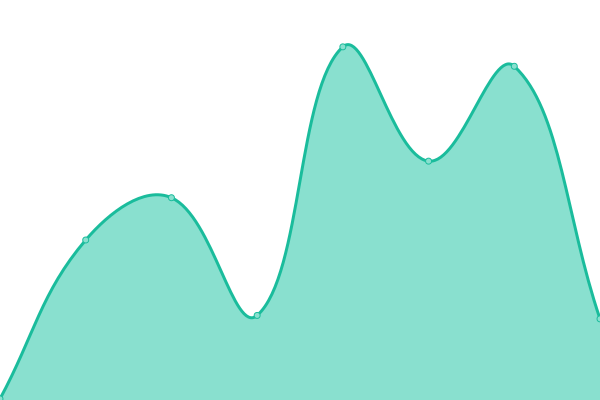
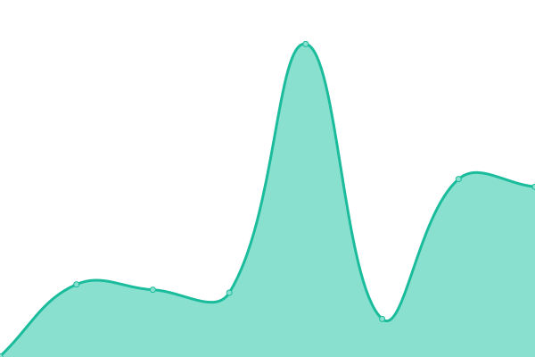

# [📈 Live Status](https://upptime.010.tw): <!--live status--> **🟩 All systems operational**

This repository contains the open-source uptime monitor and status page for [零一零科技股份有限公司](https://010.tw), powered by [Upptime](https://github.com/upptime/upptime).

With [Upptime](https://upptime.js.org), you can get your own unlimited and free uptime monitor and status page, powered entirely by a GitHub repository. We use [Issues](https://github.com/010tech/upptime/issues) as incident reports, [Actions](https://github.com/010tech/upptime/actions) as uptime monitors, and [Pages](https://upptime.010.tw) for the status page.

<!--start: status pages-->
<!-- This summary is generated by Upptime (https://github.com/upptime/upptime) -->
<!-- Do not edit this manually, your changes will be overwritten -->
<!-- prettier-ignore -->
| URL | Status | History | Response Time | Uptime |
| --- | ------ | ------- | ------------- | ------ |
|  [laws010](https://laws010.com) | 🟩 Up | [laws010.yml](https://github.com/010tech/upptime/commits/HEAD/history/laws010.yml) | 

 242ms
     
 | 

<a href="https://upptime.010.tw/history/laws010">100.00%</a>
    

|  [a85010](https://85010.tw) | 🟩 Up | [a85010.yml](https://github.com/010tech/upptime/commits/HEAD/history/a85010.yml) | 

 235ms
     
 | 

<a href="https://upptime.010.tw/history/a85010">100.00%</a>
    

|  [moneyback](https://moneyback.co) | 🟩 Up | [moneyback.yml](https://github.com/010tech/upptime/commits/HEAD/history/moneyback.yml) | 

 263ms
     
 | 

<a href="https://upptime.010.tw/history/moneyback">100.00%</a>
    

|  [zhelu](https://zhelu.tw) | 🟩 Up | [zhelu.yml](https://github.com/010tech/upptime/commits/HEAD/history/zhelu.yml) | 

 783ms
     
 | 

<a href="https://upptime.010.tw/history/zhelu">100.00%</a>
    

|  [followme](https://followme.law) | 🟩 Up | [followme.yml](https://github.com/010tech/upptime/commits/HEAD/history/followme.yml) | 

 284ms
     
 | 

<a href="https://upptime.010.tw/history/followme">100.00%</a>
    

|  [ezlawyer](https://ezlawyer.tw) | 🟩 Up | [ezlawyer.yml](https://github.com/010tech/upptime/commits/HEAD/history/ezlawyer.yml) | 

 231ms
     
 | 

<a href="https://upptime.010.tw/history/ezlawyer">100.00%</a>
    

|  [fastlaw](https://fastlaw.tw) | 🟩 Up | [fastlaw.yml](https://github.com/010tech/upptime/commits/HEAD/history/fastlaw.yml) | 

 204ms
     
 | 

<a href="https://upptime.010.tw/history/fastlaw">100.00%</a>
    

|  [a010](https://010.tw) | 🟩 Up | [a010.yml](https://github.com/010tech/upptime/commits/HEAD/history/a010.yml) | 

 347ms
     
 | 

<a href="https://upptime.010.tw/history/a010">100.00%</a>
    

<!--end: status pages-->

[**Visit our status website →**](https://upptime.010.tw)

## 📄 License

- Powered by: [Upptime](https://github.com/upptime/upptime)
- Code: [MIT](./LICENSE) © [Anand Chowdhary](https://anandchowdhary.com), supported by [Pabio](https://pabio.com)
- Data in the `./history` directory: [Open Database License](https://opendatacommons.org/licenses/odbl/1-0/)
